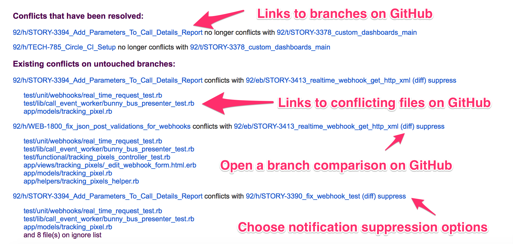
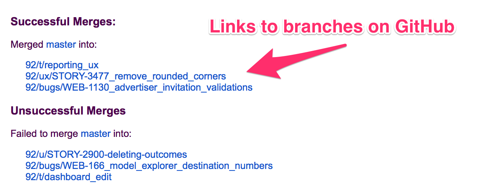

# Git Conflict Detector
The Git Conflict Detector is a tool that will automatically notify team members via email if their branches will conflict when merged. This allows team members to coordinate their efforts and avoid surprises further along with development.
The tool is also capable of pushing the merged branches up to the origin if desired.

The conflict detector consists of a standard Rails 4 web application and two rake commands:

* run:conflict_detector
    * Detects conflicts between the branches specified in the 'repositories_to_check_for_conflicts' section of the settings file.
    * After detecting conflicts in all the branches, emails a summary of the conflicts to the most recent committers on the conflicting branches.
* run:auto_merger
    * Automatically merges the branches specified in the 'branches_to_merge' section of the settings file.
    * If the branches merge cleanly, then the merged branch is pushed up to the git origin. (i.e. GitHub).
    * After attempting to merge all the branches, emails a summary of the merges to the most recent committer on the merged branches.
* Web application
    * Used by email recipients to:
        * Suppress warning emails for particular branches/conflicts
        * Unsubscribe from the emails entirely

## Install
* Install SQLite3
* Install bundler
* Install rbenv
* Install git
* Configure git to access the repo(s) you want the conflict detector to operate upon
* Clone this repo to ~/deploy/git-conflict-detector/current
* Run bundle install
* Run bundle exec rake db:generate RAILS_ENV=production
* Create a settings.production.yml file (See Settings File section below.)
* Configure secrets in the environment or settings.yml:
    * RAILS_ENV=production
    * SECRET_KEY_BASE: Standard rails secret key. Run bundle exec rake secret to generate.
    * SMTP_USER_NAME and SMTP_PASSWORD: Credentials of email account to use to send emails
    * SMTP_ADDRESS: Address of SMTP server to use for sending emails
* Install ngnix and unicorn. [Instructions here](https://www.digitalocean.com/community/tutorials/how-to-deploy-a-rails-app-with-unicorn-and-nginx-on-ubuntu-14-04)

## Settings File
### Common Settings
* cache_directory: Location to clone git repositories to. Recommended that you set this to your system temporary folder. Defaults to './tmp/cache/git'.
* maximum_branches_to_check: The maximum number of branches to check a given branch against. Used to limit checks in repositories with an extraordinarily large number of branches. Defaults to 0, which means no limit.
* email_override: Send all emails to this address instead of the intended recipient. Used for testing. Defaults to empty string.
* email_filter: Will only email addresses that appear in this list. If left empty, all emails will be sent. Defaults to empty list.
* bcc_emails: Will BCC these addresses on all emails sent by the application. Defaults to empty list.
* web_server_url: The publicly available URL of the web application. i.e. 'http://www.myserver.com'. Used in unsubscribe and suppression links sent by the application.
* dry_run: If true, the auto merger will not push the merged branches to the origin. Defaults to false.
* email_from_address: The address from which applications emails will come from. Defaults to 'gitconflictdetector@noreply.com'. Using this default will probably impact the deliverability of your emails and is not recommended.

### Conflict Detector Settings
This is a hash of repositories, each of which has its own settings. They are written like this in the yaml:
```
repositories_to_check_for_conflicts:
  MyRepoNickname:
    [SETTINGS LISTED BELOW]
    [COMMON BRANCH SELECTION SETTINGS]
```

* repository_name: The name of the repository on GitHub. You can find this in the URL of your repository on GitHub. For example, the name of this repository is: 'mikeweaver/git-conflict-detector'
* default_branch_name: The name of the default branch for the repository.
* ignore_conflicts_in_file_paths: A list of files, that if found to be in conflict, should be ignored. If all conflicting files are in the list, the branches are treated as if they do not conflict. You may use regular expressions. Defaults to empty list.
* suppress_conflicts_for_owners_of_branches: A list of branches whose owners (i.e. most recent committers) will not be notified about conflicts. Typically used for mainline branches that have many committers. Defaults to empty list.

### Auto-Merger Settings
This is a hash of repository/branch combinations, each of which has its own settings. They are written like this in the yaml:
```
branches_to_merge:
  MyRepoAndBranchNickName:
    [SETTINGS LISTED BELOW]
    [COMMON BRANCH SELECTION SETTINGS]
```

* repository_name: The name of the repository on GitHub. You can find this in the URL of your repository on GitHub. For example, the name of this repository is: 'mikeweaver/git-conflict-detector'
* default_branch_name: The name of the default branch for the repository.
* source_branch_name: The name of the branch to merge into the other branches.
* only_merge_source_branch_with_tag: The name of the tag to merge into the other branches. Typically used with CI systems to prevent revisions of the branch with failing tests from being merged. May use wildcards (*) but not regular expressions.
 
### Branch Selection
The conflict detector and auto-merger have several settings that are used to determine which branches should be operated upon.

* ignore_branches: A list of branch names that should NOT be checked for conflicts. You may use regular expressions. Defaults to empty list.
* ignore_branches_modified_days_ago: Will NOT check branches that have not been modified since the specified number of days. Defaults to 0, which means all branches will be checked regardless of age.
* only_branches: A list of branch names that SHOULD be checked for conflicts. You may use regular expressions. Defaults to empty list.

The settings are enforced in the following order:

* Branches on the 'ignore_branches' list will not be used, even if they appear in the 'only_branches' list.
* Only branches on the 'only_branches' will be used. Unless the list is empty, then all branches will be used.
* Branches that are older than 'ignore_branches_modified_days_ago' will not be used, even if they appear in the 'only_branches' list.

## How to Run
The application offers two rake commands:
* Run the conflict detector:
```bundle exec rake run:conflict_detector```
* Run the automatic merger: 
```bundle exec rake run:auto_merger```
* Start/stop the web application
```
sudo service nginx start
sudo service unicorn start
```
```
sudo service nginx stop
sudo service unicorn stop
```

## Running with Cron
* To run the conflict detector rake task using cron once per day at 5am, enter the following into crontab:
```
  0 5    *   *   *   /bin/bash -l -c 'source /home/ubuntu/.profile && cd /home/ubuntu/deploy/git-conflict-detector/current && bundle exec rake run:conflict_detector && bundle exec rake run:auto_merger >> /home/ubuntu/deploy/git-conflict-detector/current/log/cron.log 2>&1'
```
* The above command assumes you are using a user called "ubuntu" to run the application. Replace ubuntu with the appropriate user name.
* This will run your profile script, change directories to the app, then run the rake commands for the conflict detector and the auto-merger.
* Output will be logged to log/cron.log

## Emails
### Example Conflict Detector Email



### Example Auto Merge Email



## Suppressions
Emails generated by the application can be suppressed in a variety of ways:
* Recipients can unsubscribe from all emails by clicking the Unsubscribe link at the bottom of any email sent by the application
* Recipients can click the "Supress" link in the Conflict Detection emails to suppress information about particular branches:
    * Suppress information about a particular branch for a day, week, or forever
    * Suppress information about a conflict between two specific branches for a day, week, or forever
